## Exámen Interciclo - Hipermedial
#### Nombre: Zhizhpon Tacuri Cesar Eduardo

#### Diseño de la estructura de la base de Datos.

En esta imagen esta se detalla la estructura y relaciones entre tablas de la base de datos.

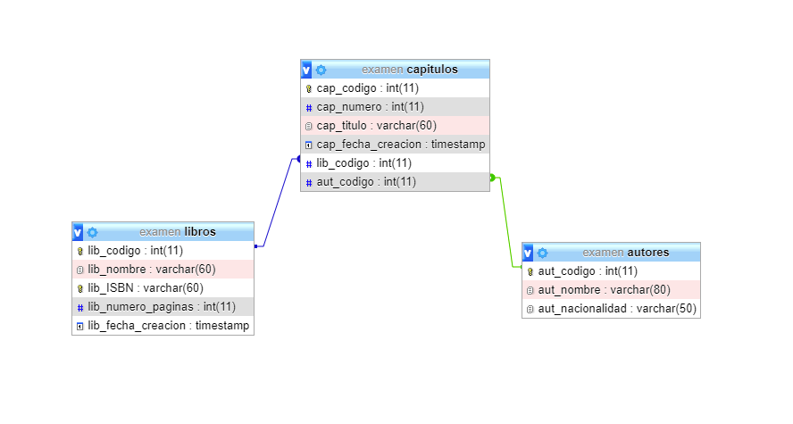

#### Desarrollar una aplicación Web basada en PHP como BackEnd y HTML + CSS como FrontEnd.

En esta imagen se muestra la estructura interna del proyecto.

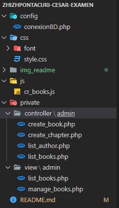

En esta imagen se detalla el uso de CSS para el diseño de la página.

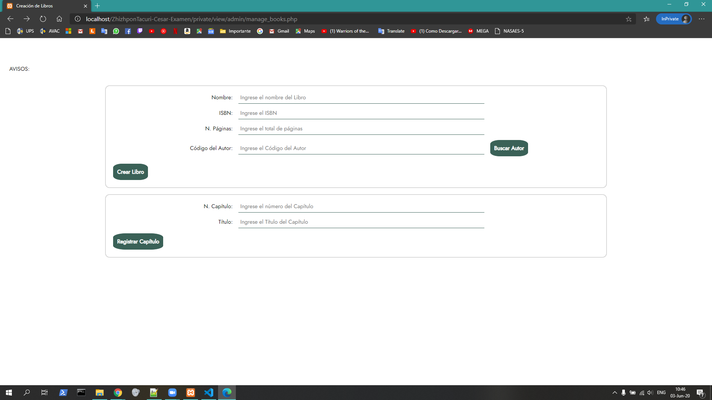

#### La persistencia a la base de datos debe ser implementada usando objetos mysqli de PHP.

Se realizó la conexión con la base de datos.

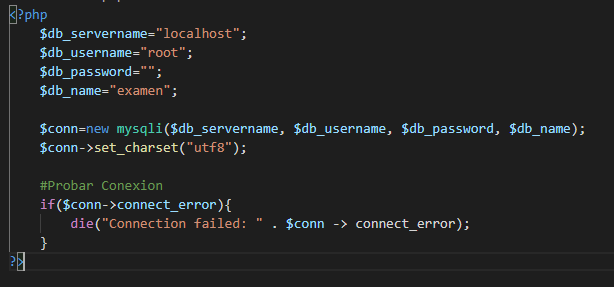

#### Los datos de los Autores deben estar previamente ingresados en la base de datos.

Se ingresaron los datos de los autores previamente.

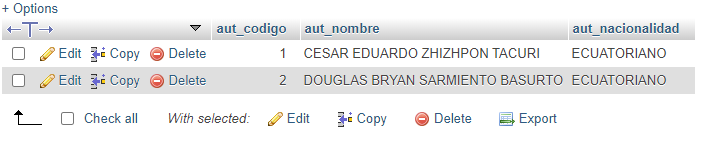

#### Al momento de registrar un Libro se debe insertar los datos del Libro y Capítulo (debe permitir ingresar varios capítulos); además, se debe ingresar el código del autor para asociar al capítulo.

Se insertan los libros con varios Capítulos con su respectivo código del autor.

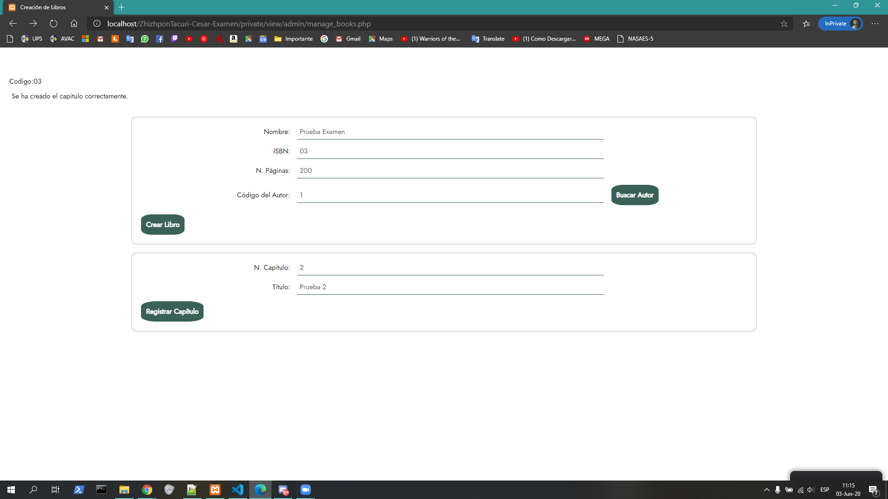

Código para crear libros y capítulos usando ajax.

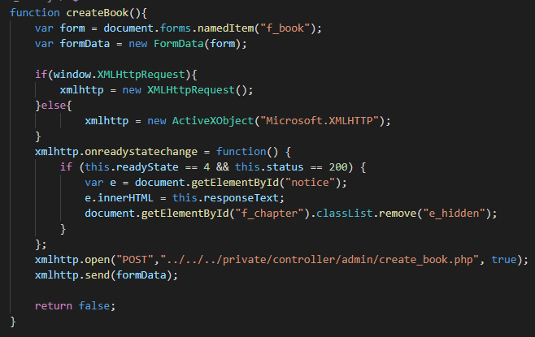

Código PHP para crear libros usando ajax.

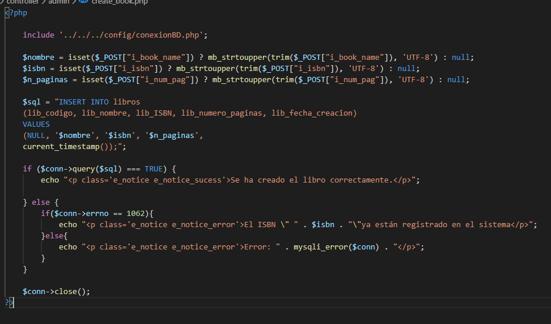

Código PHP para crear capítulos usando ajax.

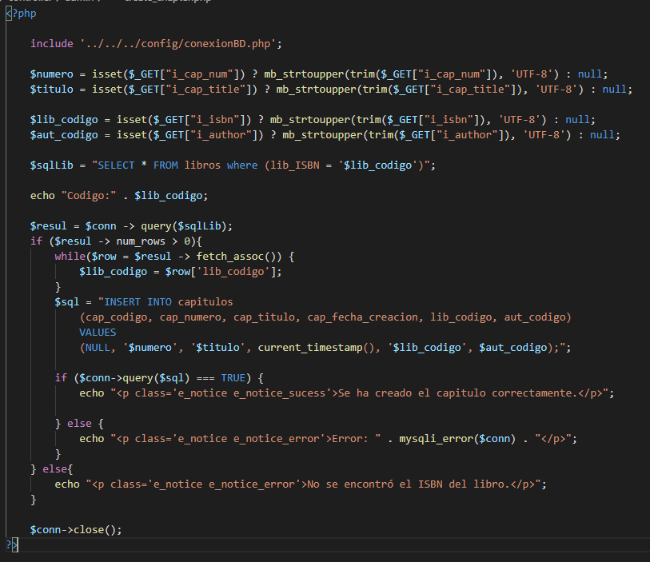

#### Al momento de ingresar el código del autor y presionar en un botón “Buscar Autor” se deberá mostrar la información del autor extrayéndola de la base de datos, para lo cuál, deberá implementar funciones AJAX.

Se lista el autor con su código.

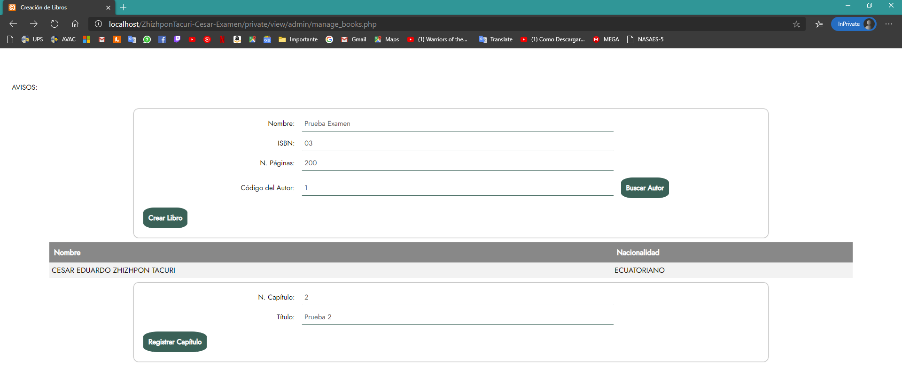

Código JS para listar el autor usando AJAX.

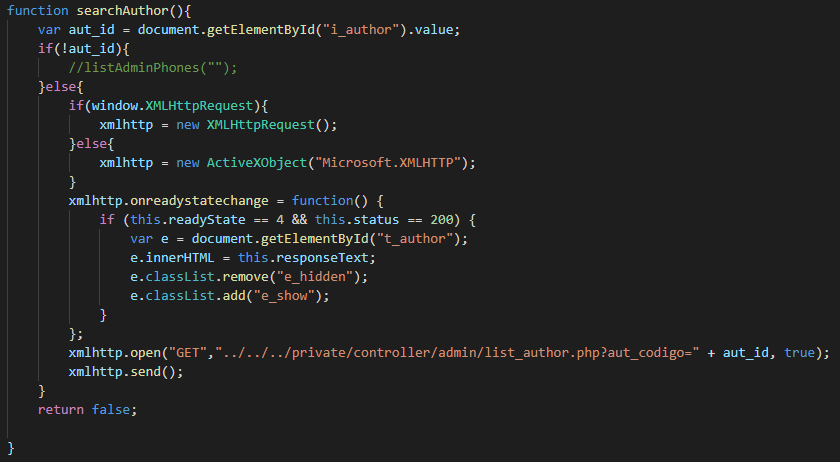

Código PHP para listar el autor usando AJAX.

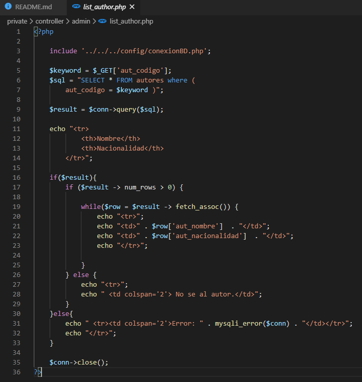

####  Al momento de listar los Libros se debe visualizar la información del Libro, Capítulos y Autores. Los códigos no deben ser visualizados.

Se listan los libros con apítulos y autores.

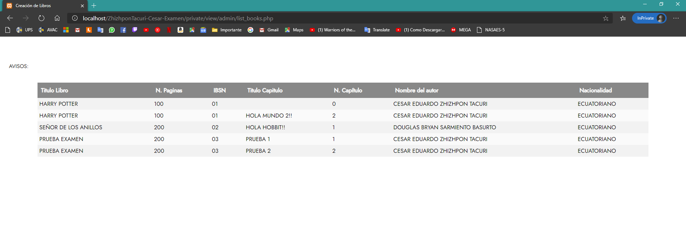

Código JS para listar los libros.

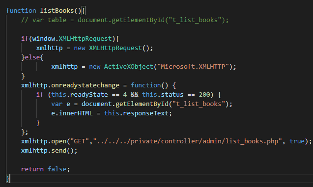

Código PHP para listar los libros.

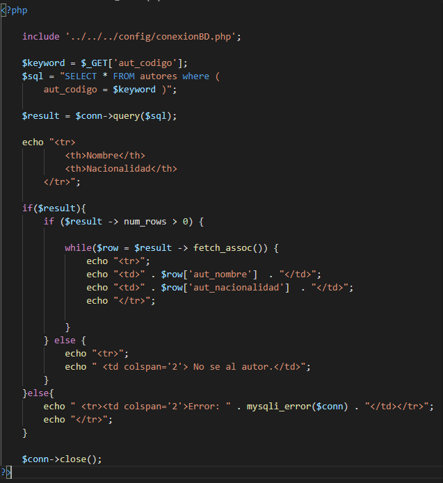

#### Los códigos deben ser generados automáticamente.

Los códigos se general Automáticamente, con la propiedad AI de la base de datos.

Autores:

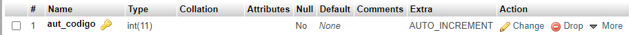

Libros:

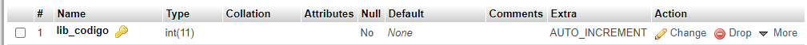

Capítulos:

